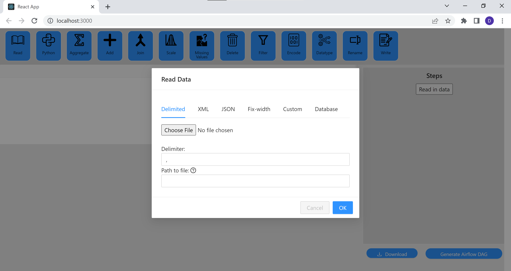

# Airflow ETL GUI

The Airflow ETL GUI is a web-app that helps data analysts and other end users of data to easily develop ETL pipelines in airflow using a Graphical User Interface (GUI). It assists to reduce the workload of a data engineer by creating pre-made ETL pipeline for them to implement.


# Table of Contents
1. [Quick Start](#quick-start)
    * [Localhost](#localhost)
    * [Online](#online)
2. [Features](#features)
   * [Read Transformation](#read)
   * [Python Transformation](#python)  
    * [Aggregate Transformation](#agg)
   * [Add Transformation](#add)  
    * [Join Transformation](#join)
   * [Scale Transformation](#scale)  
   * [Missing Values Transformation](#missing)
   * [Delete Transformation](#delete)
   * [Filter Transformation](#filter)
   * [Encode Transformation](#encode)
   * [Datatype Transformation](#datatype)
   * [Rename Transformation](#rename)
    * [Write Transformation](#write)   
    * [Generate DAG](#dag)
3. [FAQ](#faq)
4. [Command Summary](#command-summary)

--------------------------------------------------------------------------------------------------------------------

## Quick start <a name="quick-start"></a>

### Localhost <a name="localhost"></a>

1. Install Node JS if it is not already available. Installation guide can be found [here](https://nodejs.dev/en/learn/how-to-install-nodejs/)

2. Install Python if it is not already available. Installation guide can be found [here](https://wiki.python.org/moin/BeginnersGuide/Download)

3. Clone a copy of the repo onto your local machine. The guide to do this on Github Desktop can be found [here](https://docs.github.com/en/desktop/contributing-and-collaborating-using-github-desktop/adding-and-cloning-repositories/cloning-and-forking-repositories-from-github-desktop)

4. Navigate into the `be` directory of the repo using a command-line tool and run the following commands:

Windows:
```
.\venv\Scripts\activate.bat
cd venv
pip install -r requirements.txt
set FLASK_APP=hello.py
set FLASK_ENV=development
flask run
```
Mac:
```
./venv/Scripts/activate
cd venv
pip install -r requirements.txt
set FLASK_APP=hello.py
set FLASK_ENV=development
flask run
```

5. Navigate into the `fe` directory of the repo using a command-line tool and run the following commands:
```
npm install
npm start
```

6. Visit [this](http://localhost:3000) website


### Online <a name="online"></a>

1. Visit [this](https://fyp-frontend.onrender.com/) website to use the application online. Do note that the server used is slow and will only work on smaller datasets. <br>

   


:exclamation: Refer to the [Features](#features) below for details of each command.

--------------------------------------------------------------------------------------------------------------------

## Features <a name="features"></a>

<!-- ### Viewing help : `help` <a name="help"></a>

Shows a message explaining how to access the help page.


Format: `help` -->

### Read Transformation <a name="read"></a>

This is the first step in every pipeline. Data needs to be read in to allow transformations and writes. 

Types of Read:
1. Delimited
    * File Upload: Delimited file to read
        * File will be parsed using Panda's read_csv
    * Delimiter: Delimited of file chosen
    * Path: Path to file to be read in Airflow
        * Path can be variable using [glob](https://docs.python.org/3/library/glob.html)
2. XML
    * File Upload: XML file to read
        * File will be parsed using Panda's read_xml
    * Path: Path to file to be read in Airflow
        * Path can be variable using [glob](https://docs.python.org/3/library/glob.html)
3. JSON
    * File Upload: JSON file to read
        * File will be parsed using Panda's read_json   
    * Path: Path to file to be read in Airflow
        * Path can be variable using [glob](https://docs.python.org/3/library/glob.html)
4. Fix-Width
    * File Upload: Fix-width file to read
        * File will be parsed using Panda's read_fwf function
    * Path: Path to file to be read in Airflow
        * Path can be variable using [glob](https://docs.python.org/3/library/glob.html)
5. Custom
    * File Upload: File to read
    * Path: Path to file to be read in Airflow
        * Path can be variable using [glob](https://docs.python.org/3/library/glob.html)
    * Code: Python code to be executed in order to read file
        * Uploaded file can be accessed in the variable `data` as a StringIO object
        * Final dataframe should be stored in the variable `df` 
6. Database
    * Database Type: Type of database to be read from
        * Currently available database types are PostgreSQL, MySQL, Oracle, MsSql and Sqlite
    * Upload csv sample: Allows user to upload a sample of the data instead of connecting directly to the database
    * File Upload: CSV file to read
        * File will be parsed using Panda's read_csv
    * Airflow Connection ID: Connection id of database in airflow
        * For more information, see [this](https://airflow.apache.org/docs/apache-airflow/2.5.1/howto/connection.html#storing-connections-in-the-database)
    * Host: Hosting location of database
    * Port: Access port of the database
    * User: Username of the user used to login
    * Password: Password of the user used to login
    * Database Name: Name of the database to be connected to
    * SQL Query: SQL query to be executed in order to obtain the data
      * Use `{kwargs['macro_name']}` in order to access airflow macros in SQL query


### Python Transformation <a name="python"></a>

Transforms data using python.

Parameters:
* Code: Python code to be executed in order to transform data
    * Current data can be accessed in the variable `df` as a DataFrame
    * Final dataframe should be stored in the variable `final_df` 

### Aggregate Transformation <a name="agg"></a>

Transforms data by aggregating the data based on inputs given

Parameters:
* Group By: Columns to be grouped by
* Aggregation Column: Columns to aggregate
* Aggregation Function: Function to apply in order to aggregate aggregation columns
* Add: Add an aggregation
* Delete: Remove last aggregation

Aggregation Functions:
* Sum: Addition of all rows in group
* Mean: Average (Mean) of all rows in group
* Min: Minimum of all rows in group
* Max: Maximum of all rows in group
* Count: Number of non-null rows in group
* First: First row in group
* Last: Last row in group
* Median: 50th Percentile of all rows in group
* Std: Standard deviation of all rows in group
* Var: Variance of all rows in group


### Add Transformation <a name="add"></a>

Transforms data by adding a new column using pre-defined functions

Parameters:
* New Column Name: Name of new column
* Function: Function to apply in order to generate new column
* Add: Add a column
* Delete: Remove last row from transformation

Add Functions:
* Concat: Converts columns to string and concatenates the strings
  * Columns: Columns to be concatenated
* Add to date: Adds specified amount to datetime value
  * Type: Portion of datetime value to add to
  * Number: Amount to be added
  * Column: Datetime column to add to
* Abs: Absolute value of a column
  * Column: Numeric column to apply absolute to
* Mean: Calculate mean per row across columns
  * Columns: Numeric columns to apply mean to
* Ceil: Round up value of a column to nearest integer
  * Column: Numeric column to round up
* Floor: Round down value of a column to nearest integer
  * Column: Numeric column to round down
* Round:  Round off value of a column to nearest integer
  * Column: Numeric column to round off
* Cumsum: Running total
  * Column: Numeric column to calculate running total
* Sum: Calculate sum of columns per row
  * Columns: Numeric columns to add together
* Subtract: Subtract columns per row
  * Columns: Numeric columns to subtract  [1st Col - 2nd Col - 3rd Col ....]
* Multiply: Multiply columns per row
  * Columns: Numeric columns to multiply
* Divide: Division of columns per row
  * Columns: Numeric columns to divide [1st Col / 2nd Col / 3rd Col ....]
* Max: Maximum of columns per row
  * Columns: Numeric columns to find maximum of
* Min: Minimum of columns per row
  * Columns: Numeric columns to find minimum of
* Variance: Variance of columns per row
  * Columns: Numeric columns to find variance of
* Stdev: Standard deviation of columns per row
  * Columns: Numeric columns to find standard deviation of
* Median: Median of columns per row
  * Columns: Numeric columns to find median of
* Log10: Log base 10 of column
  * Column: Numeric column to log
* Log2: Log base 10 of column
  * Column: Numeric column to log
* Ln: Log base e of column
  * Column: Numeric column to log
* Sqrt: Square root of column
  * Column: Numeric column to square root
* Length: Length of column
  * Column: Column to find length of
* Reverse: Reverses column
  * Column: Column to reverse


### Join Tranformation <a name="join"></a>

Transforms data by joining a secondary dataset to the original

Parameters:
* Read: New dataset to join, refer to [Read Transformation](#read)
* Master Join Key: Join key from original dataset
* Secondary Join Key: Join key from new dataset
* Join Type: Type of join

Join Types:
* Left: Use only keys from original dataset
* Right: Use only keys from new dataset
* Outer: Use union of keys from both datasets
* Inner: Use intersection of keys from both datasets
* Cross: Creates the cartesian product from both datasets


### Scale Transformation <a name="scale"></a>

Transforms data by scaling the data using predefined methods

Parameters:
* Scaling: Scaling to apply
* Columns: Columns to apply scaling to
* Add: Add a column
* Delete: Remove last row from transformation

Scaling Methods:
* Standard Scaler: Standardize features by removing the mean and scaling to unit variance
  * with_mean: If true, center the data before scaling
  * with_std: If true, scale the data to unit variance
* MinMax Scaler: Transform features by scaling each feature to a given range
  * Clip: Set to True to clip transformed values of held-out data to provided range
  * Min: Desired minimum of range of transformed data
  * Max: Desired maximum of range of transformed data
* MaxAbs Scaler: Scale each feature by its maximum absolute value
* Robust Scaler: Scale features using statistics that are robust to outliers
  * with_centering: If true, center the data before scaling
  * with_scaling: If true, scale the data to interquartile range
  * unit_variance: If true, scale data so that normally distributed features have a variance of 1
  * Quantile min: Min quantile range used to calculate scale
  * Quantile max: Max quantile range used to calculate scale
* Quantile Transformer: Transform features using quantiles information
  * Number of quantiles: Number of quantiles to be computed
  * Output distribution: Marginal distribution for the transformed data
* Power Transformer: Apply a power transform featurewise to make data more Gaussian-like
  * Method: The power transform method
  * Standardize: Set to true to apply zero-mean, unit-variance normalization to the transformed output


### Missing Values Transformation <a name="missing"></a>

Transforms data by helping to deal with missing values in the dataset

Parameters:
* Method: Method of dealing with missing values to apply
* Column: Column to apply missing values to
* Add: Add a column
* Delete: Remove last row from transformation

Methods to deal with missing values:
* Delete Rows: Remove rows with missing values
* Impute: Impute values on rows with missing values
* Indicator: Add a separate column with an indicator if value is misisng

Impute Types:
* Mean: Impute average(mean) value of row
* Median: Impute 50th percentile of the values in the row
* Mode: Impute the most common value in the row
* Custom: Impute the given value into the row
  * Custom Impute: Value to impute
* KNN: Imputation for completing missing values using k-Nearest Neighbors
  * Num of Neighbours: Number of neighboring samples to use for imputation
  * Add Indicator: Add indicator for missing values to account for missingness despite imputation
  * Weights: Weight function used in prediction
    * Uniform: All points in each neighborhood are weighted equally
    * Distance: Weigh points by the inverse of their distance
  * Columns to use for Imputation: Columns of the dataset to use for imputation
* Linear Regression: Imputation for completing missing values using Linear Regression
  * Columns to use for Imputation: Columns of the dataset to use for imputation

### Delete Transformation <a name="delete"></a>

Transforms data by removing unwanted columns in the dataset

Parameters:
* Columns to delete: Columns to be removed

### Filter Transformation <a name="filter"></a>

Transforms data by filtering rows of the dataset

Parameters:
* Query: SQL-like query to run on the dataset to filter
  * E.g. `amount < 100`

### Encode Transformation <a name="encode"></a>

Transforms data by helping to deal with missing values in the dataset

Parameters:
* Method: Method of encoding to apply
* Column: Column to apply encoding to
* Add: Add a column
* Delete: Remove last row from transformation

Method:
* KBinsDiscretizer:
  * Number of Bins: The number of bins to produce (>2)
  * Strategy: Strategy used to define the widths of the bins
    * Uniform: All bins in each feature have identical widths
    * Quantile: All bins in each feature have the same number of points
    * Kmeans: Values in each bin have the same nearest center of a 1D k-means cluster
* LabelBinarizer: Encode target labels with value between 0 and n_classes-1
* OrdinalEncoder: Encode categorical features as an integer array
* Binarizer: Set feature values to 0 or 1 according to a threshold
  * Threshold: Feature values below or equal to this are replaced by 0, above it by 1
* LabelEncoder: Binarize labels in a one-vs-all fashion

### Datatype Transformation <a name="datatype"></a>

Transforms data by changing datatype of columns

Parameters:
* Datatype: Datatype to convert to
* Columns: Columns to apply datatype to
* Add: Add a column
* Delete: Remove last row from transformation

### Rename Transformation <a name="rename"></a>

Transforms data by changing the name of columns

Parameters:
* Column: Column to give new name
* New Name: New name of column
* Add: Add a row to perform a second transformation of the same type
* Delete: Remove last row from transformation

### Write Transformation <a name="write"></a>

This is the last step in every pipeline. Data is written in order for it to be used by the end users. 

Types of Write:
1. Delimited
    * Delimiter: Delimited of file
    * Path: Path to write file to
2. Database
    * Database type: Type of database to write to
      * Currently supported databases: PostgreSQL MySQL, Oracle, MsSql, Sqlite, Redshift, Hive
    * Truncate & Reload: Truncate and reload entire table
    * Airflow Connection Id: Connection id of database in airflow
        * For more information, see [this](https://airflow.apache.org/docs/apache-airflow/2.5.1/howto/connection.html#storing-connections-in-the-database)
    * Table name: Name of table to write to

### Generate DAG <a name="dag"></a>

This helps to generate the Airflow DAG.

Inputs:
1. DAG ID: Unique ID to identify this DAG
2. Processing Directory: The directory in which intermediate data can be stored
3. Schedule Interval: How often the DAG should be run
4. File Cleanup: Turning this on would clean up the intermediate files created
5. Email: E-mail to send notification on failure of DAG


--------------------------------------------------------------------------------------------------------------------

## FAQ <a name="faq"></a>

**Q**: 
**A**:

--------------------------------------------------------------------------------------------------------------------

## Command Summary <a name="command-summary"></a>

| Transformation | Use Case                                     |
|----------------|----------------------------------------------|
| Read           | Read in data                                 |
| Python         | Use Python code to transform data            |
| Aggregate      | Aggregate the data and apply functions       |
| Add            | Apply functions to existing columns          |
| Join           | Combine the data with another dataset        |
| Scale          | Re-scale data to a specific scale            |
| Missing Values | Deal with missing values in the dataset      |
| Delete         | Remove columns from the data                 |
| Filter         | Remove specific rows from the data           |
| Encode         | Encode the data to numeric values            |
| Datatype       | Change the datatype that represents the data |
| Rename         | Change the name of the columns               |
| Write          | Write the data to a destination              |